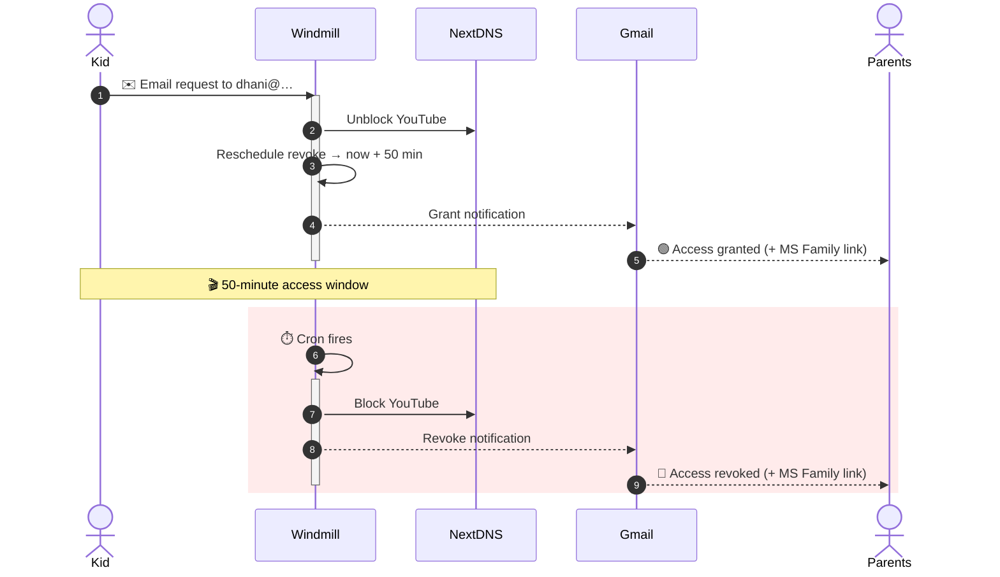
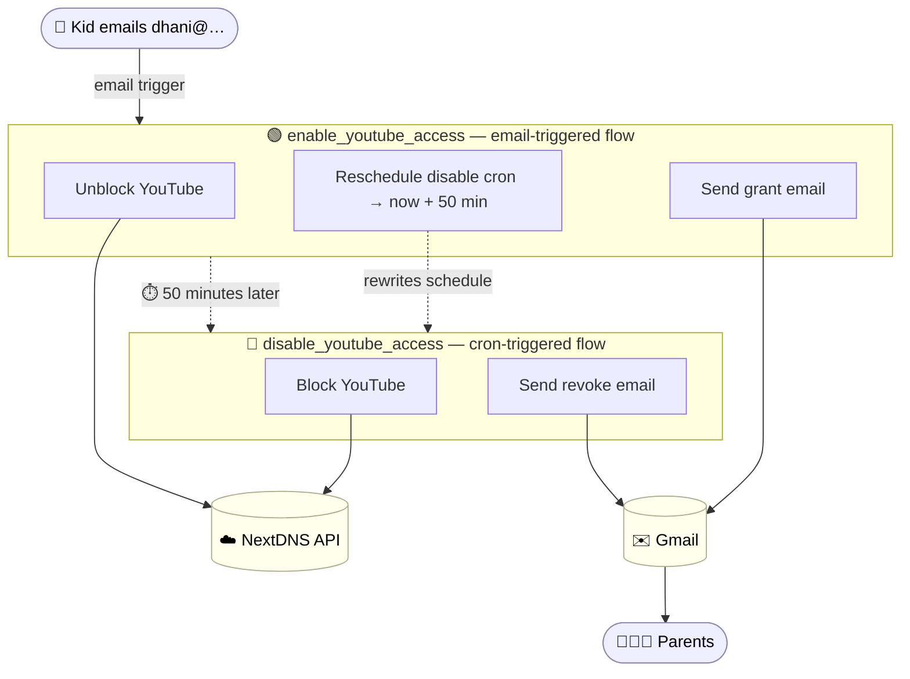

# betterhome — Time-Boxed YouTube Access for Kids

A [Windmill](https://www.windmill.dev/) workspace that gives kids a **self-service,
auto-approved, time-limited** way to access YouTube — and gives parents
notifications and an audit trail.

## The Problem

YouTube is a double-edged sword. Educational channels (Khan Academy, etc.) are a
genuine learning resource, while animation / fandom / entertainment / gaming
content is a distraction for students.

The trouble is that **YouTube access is all-or-nothing at the domain level**:

- A Khan Academy video — `https://www.youtube.com/watch?v=wHC245cVdHw`
- An "Avatar of Legends" fandom video — `https://www.youtube.com/watch?v=kXShLPXfWZA`

…are indistinguishable from the URL. The channel isn't in the link, so DNS-level
tools can't separate "good" YouTube from "bad" YouTube.

This breaks the obvious setups:

- **NextDNS** can block/unblock `youtube.com` and offers parental controls, ad &
  tracker blocking, privacy/security filtering, usage analytics, and custom
  rules — but it **cannot tell which channel** a video belongs to. Granting
  YouTube during school hours for educational use also opens the door to
  entertainment content. NextDNS "Recreation time" scheduling doesn't solve this
  either.
- **Microsoft Family Safety** can do request/approve workflows and shows visited
  sites, but **approvals are manual, slow, and have no public API** — the app is
  closed, so it can't be automated.

Neither tool alone delivers what's actually needed: **fast, time-boxed, auditable
access on demand.**

## The Solution

Split responsibilities across three layers and let Windmill be the glue:

| Layer | Role |
|---|---|
| **NextDNS** | Fast, **automatable** enforcement — its API can block/unblock YouTube instantly |
| **MS Family Safety** | After-the-fact **monitoring** — review which sites were actually visited |
| **Windmill** | The **request → approve → expire** workflow that MS Family lacks |

### How it works

1. **Request** — The kid sends an email to a dedicated address (`dhani@…`). This
   is a Windmill email trigger.
2. **Approve (~10 s)** — The email triggers the `enable_youtube_access` flow,
   which calls the NextDNS API to **unblock YouTube** — no human in the loop.
3. **Time-box (50 min)** — The same flow rewrites the `disable_youtube_access`
   cron schedule to fire exactly **50 minutes from now**.
4. **Notify** — A "access granted" email is sent with the enable/disable
   timestamps and a link to MS Family Safety.
5. **Auto-revoke** — At the 50-minute mark, the scheduled `disable_youtube_access`
   flow calls the NextDNS API to **re-block YouTube** and sends an
   "access revoked" email — again linking to MS Family Safety so parents can
   review the visited sites.

## Architecture

## Components

All entities live under the `f/betterhome/` folder.

### Flows

- **`enable_youtube_access`** — Triggered by email. Steps:
  - `enable_access_to_youtube` — unblocks the `youtube` service in NextDNS
  - `safe_script` — rewrites the `disable_youtube_access` schedule to `now + 50 min`
  - `send_enable_access_email_to_parents` — sends the "access granted" email
- **`disable_youtube_access`** — Triggered by its cron schedule. Steps:
  - `disable_access_to_youtube` — re-blocks the `youtube` service in NextDNS
  - `jolly_script` — sends the "access revoked" email

### Scripts

| Script | Purpose |
|---|---|
| `enable_access_to_youtube.py` | NextDNS API call to unblock the `youtube` parental-control service |
| `disable_access_to_youtube.py` | NextDNS API call to block the `youtube` parental-control service |
| `safe_script.py` | Updates the `disable_youtube_access` schedule cron to fire 50 min from now |
| `send_enable_access_email_to_parents.py` | Sends the "access granted" email via Gmail |
| `jolly_script.py` | Sends the "access revoked" email via Gmail |

### Trigger & Schedule

- **`revolutionary_email_trigger`** — Email trigger, local part `dhani`. Sending
  an email to that address starts the `enable_youtube_access` flow.
- **`disable_youtube_access.schedule.yaml`** — Cron schedule for the revoke flow.
  Its cron expression is **dynamically rewritten** by `safe_script` on each grant.

### Resources & Variables

- `unreal_gmail` — Gmail resource (OAuth token) used to send emails.
- `efficient_git_repository` — Git-sync resource for this repo.
- `f/betterhome/nextdns_api_key` — NextDNS API key (Windmill variable).
- `f/betterhome/nextdns_profile_id` — NextDNS profile ID (Windmill variable).

### Other

- `well_rounded_app__raw_app` — A raw app, currently still at "hello world"
  scaffolding. Not yet built out.

## Configuration Notes

- **Access window** is 50 minutes, hard-coded in `safe_script.py` (cron offset)
  and the email scripts (displayed times).
- **Notification recipients** are hard-coded in both flow YAMLs (three parent
  addresses; see `f/betterhome/*__flow/flow.yaml`).
- Timestamps in emails use the `Europe/Paris` (CET) timezone; the disable
  schedule uses `Europe/Zurich`.

## Known Gaps / Future Work

- **Kids not notified** — emails currently go only to the three addresses above.
  If the requesting kid should also get the grant/revoke emails, their address
  needs adding.
- **No abuse guardrail** — any email to `dhani@…` grants a fresh 50 minutes. A
  repeat request mid-window simply pushes the disable cron out again, allowing
  unlimited extension. Consider a "one grant per N hours" rule or an
  "ignore if already enabled" check.
- **Schedule re-arm** — confirm that `safe_script` reliably re-arms the cron when
  the previous occurrence has already fired.
- **Duplicate logic** — `enable_access_to_youtube.py` and
  `disable_access_to_youtube.py` are near-identical (they differ only in a
  `blocked` flag) and could be consolidated into one parameterized script.
- **Naming** — several entities still carry Windmill's auto-generated names
  (`jolly_script`, `safe_script`, `unreal_gmail`, `revolutionary_email_trigger`)
  rather than descriptive ones.
</content>
</invoke>
